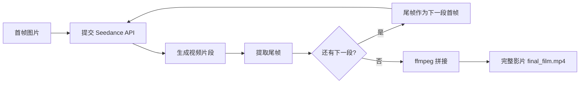
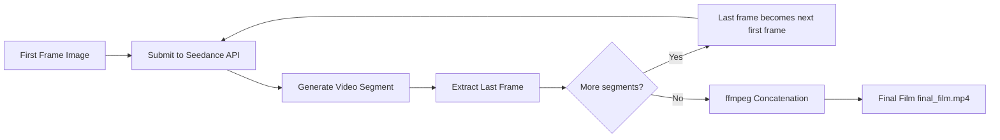

# Seedance Chain

**利用火山引擎 Ark API（Seedance 系列模型）实现链式续拍，自动生成长视频的 Python 工具集。**

**A Python toolkit for chained video generation using Volcano Engine Ark API (Seedance models), automating long-form video production through sequential shot continuation.**

---

## 中文文档

### 核心价值

Seedance 2.0 的 agent 模式尚未开放 API，本项目在 **Seedance 1.5 Pro** 基础上实现了类似的**半自动化导演工作流**：

- **链式续拍**：自动提取上一段视频尾帧作为下一段首帧，保证画面连续性
- **API 优势**：相比网页端，API 调用在内容审核上限制更少，可实现更多风格化创作
- **批量自动化**：一键提交多段镜头，自动轮询等待、下载、拼接，省去大量手动操作

### 架构流程



### 功能特性

- 支持 Seedance 1.5 Pro / 1.0 Pro / 1.0 Pro Fast / 1.0 Lite 全系列模型
- 链式续拍模式（`--chain`）：尾帧自动衔接下一段首帧
- 草稿预览模式（`--draft`）：480p 快速验证构图和动作
- 批量并发控制：可配置每批提交数量（`--batch-size`）
- 自动 ffmpeg 拼接：重编码 + 去重复帧处理衔接跳帧
- 支持首帧/尾帧/参考图多种输入方式
- 音频生成支持（Seedance 1.5 Pro）
- 命令行参数灵活控制生成范围

### 快速开始

#### 1. 安装依赖

```bash
python -m venv venv
source venv/bin/activate
pip install 'volcengine-python-sdk[ark]'
```

#### 2. 配置 API Key

在火山引擎方舟控制台获取 API Key：
https://console.volcengine.com/ark/region:ark+cn-beijing/apiKey

然后在方舟控制台 → 模型广场搜索 `seedance`，开通所需模型。

创建 `.env` 文件（参考 `.env.example`）：

```bash
cp .env.example .env
# 编辑 .env，填入你的 API Key
```

或直接修改 `seedance_video.py` 中的 `ARK_API_KEY` 变量。

#### 3. 编写镜头脚本

在 `seedance_video.py` 中编辑 `SHOTS` 列表，定义每个镜头的参数：

```python
SHOTS = [
    {
        "id": "S01",
        "name": "开场",
        "prompt": "你的提示词...",
        "first_frame": "/path/to/first_frame.png",  # 可选
        "duration": 12,
        "generate_audio": True,
    },
    # ...更多镜头
]
```

#### 4. 运行

```bash
# 链式续拍，逐段串行
python seedance_video.py --chain --batch-size 1

# 只生成指定镜头
python seedance_video.py --chain --batch-size 1 S01 S02 S03

# 草稿快速预览
python seedance_video.py --chain --batch-size 1 --draft

# 生成全部镜头（非续拍，可并发）
python seedance_video.py
```

### 命令行参数

| 参数 | 说明 | 默认值 |
|------|------|--------|
| `S01 S02 ...` | 指定要生成的镜头 ID | 全部生成 |
| `--chain` | 续拍模式：自动用前一段尾帧作为下一段首帧 | 关闭 |
| `--draft` | 草稿预览模式（480p，仅 1.5 Pro） | 关闭 |
| `--batch-size N` | 每批并发提交数量 | 2 |
| `--no-concat` | 跳过 ffmpeg 拼接步骤 | 关闭 |

### 文件结构

```
jimeng-api/
├── seedance_video.py          # 主脚本（Ark API，支持链式续拍）
├── jimeng_video.py            # 旧版脚本（Visual API，即梦 3.0 Pro）
├── storyboard_script.py       # 分镜脚本定义（镜头+台词+提示词）
├── Seedance_API_经验手册.md    # 详细踩坑记录与经验总结
├── .env.example               # API Key 配置模板
├── .gitignore
├── storyboard/                # 分镜首帧图素材
├── output/                    # 生成结果
│   ├── S01.mp4 ~ SXX.mp4     # 各段视频
│   ├── S01_last_frame.png     # 末帧图片（续拍用）
│   ├── S01_video_url.txt      # 视频下载地址
│   └── final_film.mp4         # 拼接后完整影片
└── venv/                      # Python 虚拟环境
```

### 踩坑记录

| 问题 | 原因 | 解决方案 |
|------|------|----------|
| `ak&sk authentication not supported` | 内容生成 API 不支持 AK/SK 认证 | 使用 API Key：`Ark(api_key="...")` |
| `ModelNotOpen` | 账号未开通对应模型 | 去方舟控制台模型广场逐个开通 |
| 提交后长时间无响应 | 首帧图过大（>1MB） | 压缩图片到 1MB 以内 |
| 拼接后跳帧/花屏 | 各段编码参数不一致 | 使用 `-c:v libx264 -c:a aac` 重编码拼接 |
| 打戏画面混乱 | 1.5 Pro 对复杂多人动作理解有限 | 简化动作描述、缩短时长，或等 2.0 |
| 人物一致性偏移 | 续拍链中间段可能漂移 | 确保首帧图质量，prompt 中重复描述关键特征 |

### 注意事项

- **API Key 安全**：请勿将 API Key 提交到公开仓库，使用 `.env` 文件管理
- **模型开通**：首次使用需在火山引擎方舟控制台手动开通 Seedance 模型
- **续拍链必须串行**：`--chain` 模式下建议 `--batch-size 1`，否则无法获取上一段尾帧
- **Seedance 2.0**：截至 2026 年 2 月，2.0 API 尚未开放，仅控制台体验中心可用
- **内容合规**：请遵守火山引擎平台的内容使用规范

### License

MIT

---

## English Documentation

### Why This Project

Seedance 2.0's agent mode is not yet available via API. This project implements a **semi-automated director workflow** on top of **Seedance 1.5 Pro**, achieving similar chained video generation capabilities:

- **Chain continuation**: Automatically extracts the last frame of each video segment as the first frame of the next, ensuring visual continuity
- **API advantages**: Compared to the web interface, API calls have fewer content moderation restrictions, enabling more stylized creative work
- **Batch automation**: Submit multiple shots at once, with automatic polling, downloading, and concatenation

### Architecture



### Features

- Supports full Seedance model lineup: 1.5 Pro / 1.0 Pro / 1.0 Pro Fast / 1.0 Lite
- Chain continuation mode (`--chain`): Automatic last-frame-to-first-frame handoff
- Draft preview mode (`--draft`): Quick 480p validation of composition and motion
- Configurable batch concurrency (`--batch-size`)
- Automatic ffmpeg concatenation with re-encoding and duplicate frame trimming
- Supports first frame / last frame / reference image inputs
- Audio generation support (Seedance 1.5 Pro)
- Flexible CLI argument control

### Quick Start

#### 1. Install Dependencies

```bash
python -m venv venv
source venv/bin/activate
pip install 'volcengine-python-sdk[ark]'
```

#### 2. Configure API Key

Obtain your API Key from the Volcano Engine Ark console:
https://console.volcengine.com/ark/region:ark+cn-beijing/apiKey

Then enable the Seedance models you need in the Ark console Model Marketplace.

```bash
cp .env.example .env
# Edit .env with your API Key
```

Or modify the `ARK_API_KEY` variable directly in `seedance_video.py`.

#### 3. Define Your Shots

Edit the `SHOTS` list in `seedance_video.py`:

```python
SHOTS = [
    {
        "id": "S01",
        "name": "Opening",
        "prompt": "Your prompt here...",
        "first_frame": "/path/to/first_frame.png",  # optional
        "duration": 12,
        "generate_audio": True,
    },
    # ...more shots
]
```

#### 4. Run

```bash
# Chain mode, sequential
python seedance_video.py --chain --batch-size 1

# Generate specific shots only
python seedance_video.py --chain --batch-size 1 S01 S02 S03

# Draft preview
python seedance_video.py --chain --batch-size 1 --draft

# Generate all shots (non-chain, concurrent)
python seedance_video.py
```

### CLI Arguments

| Argument | Description | Default |
|----------|-------------|---------|
| `S01 S02 ...` | Shot IDs to generate | All shots |
| `--chain` | Chain mode: auto-use previous last frame as next first frame | Off |
| `--draft` | Draft preview mode (480p, 1.5 Pro only) | Off |
| `--batch-size N` | Concurrent batch size | 2 |
| `--no-concat` | Skip ffmpeg concatenation | Off |

### Gotchas

| Issue | Cause | Solution |
|-------|-------|----------|
| `ak&sk authentication not supported` | Content generation API doesn't support AK/SK | Use API Key: `Ark(api_key="...")` |
| `ModelNotOpen` | Model not enabled on your account | Enable in Ark console Model Marketplace |
| Long wait after submission | First frame image too large (>1MB) | Compress to under 1MB |
| Frame jumps after concat | Inconsistent encoding params across segments | Use `-c:v libx264 -c:a aac` re-encoding |
| Chaotic fight scenes | 1.5 Pro struggles with complex multi-person action | Simplify action descriptions, shorten duration, or wait for 2.0 |
| Character consistency drift | Mid-chain segments may deviate | Ensure high-quality first frames, repeat key features in prompt |

### Notes

- **API Key security**: Never commit your API Key to public repositories; use `.env` files
- **Model activation**: First-time users must manually enable Seedance models in the Ark console
- **Chain mode must be sequential**: Use `--batch-size 1` with `--chain` to ensure last frame availability
- **Seedance 2.0**: As of February 2026, the 2.0 API is not yet available; only accessible via the console
- **Content compliance**: Please follow the Volcano Engine platform's content usage policies

### License

MIT
